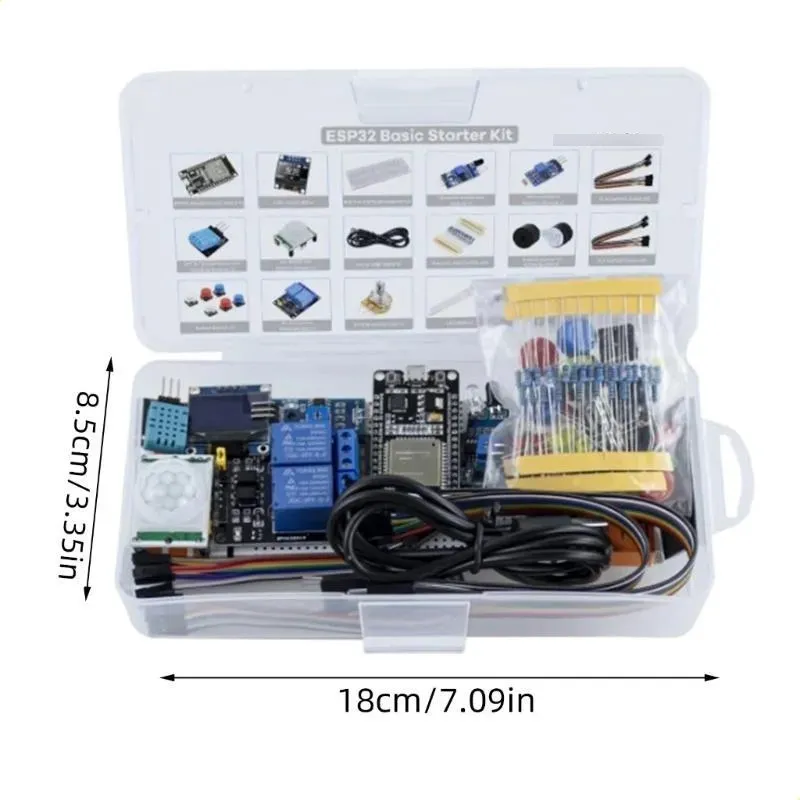

# ESP32 Starter Kit: Interactive Guide

**One bench, six phases, every component in the kit.** A beginner's journey from
a ~€13 AliExpress ESP32 starter kit to a working smart-room hub — environment
monitoring, motion alarm, appliance relays, WiFi dashboard, and Home Assistant —
with an interactive wiring guide for every step along the way.

**▶ Live demo: [eug.github.io/esp32-starter-kit-guide](https://eug.github.io/esp32-starter-kit-guide/)**

<p align="center"></p>

## The story

I bought a basic ESP32 starter kit and, as a complete beginner, wanted one
project that would teach me **every component in the box** — not twenty
disconnected blink sketches. I asked Claude (Fable 5) to design that project and
generate a step-by-step interactive guide for it. The result is **Room
Guardian**: a smart-room hub built in six phases, where each phase adds
components to a bench that is wired once and never torn down.

## The interactive guide

**Live at [eug.github.io/esp32-starter-kit-guide](https://eug.github.io/esp32-starter-kit-guide/)** —
or open [`docs/index.html`](docs/index.html) in any browser; it's a single
self-contained file, no server needed.

What it does:

- **Phase tabs** (1–6) with step-by-step cards and checkboxes; progress is
  saved in your browser.
- **A live bench diagram** — an SVG of both breadboards that draws *exactly*
  the wires the selected step asks for, with earlier wiring dimmed and future
  wiring hidden. Pan and zoom to see individual holes.
- **Wire-color coding** matching the [convention below](#wire-colors).
- **Interleaved CODE cards** — after the wiring that brings a module to life,
  an annotated walkthrough of the real firmware behind it, each ending in a
  tweak-and-reflash experiment (break the debounce, retune the siren, make a
  relay chatter — then revert).
- **A (?) help view** with all serial commands and common fixes.

## Hardware & cost (~€19 total)

| Part | Price | Where |
|------|-------|-------|
| [ESP32 Basic Starter Kit](https://pt.aliexpress.com/item/1005007749694314.html) | ~€13 | AliExpress |
| 120pc Dupont jumper kit (40 M-M / 40 F-M / 40 F-F) | ~€3 | AliExpress / anywhere |
| Second 830-point breadboard | ~€3 | AliExpress / anywhere |

The kit alone covers Phase 1; the extra jumpers and second breadboard are
needed from Phase 2 on (the kit ships only 10 of each jumper type). Relay
loads for Phase 4 (a 12V LED strip or USB fan) are optional — low voltage
only, no mains.

<details>
<summary><strong>Full kit inventory</strong> — what's in the box and where each part ends up</summary>

| # | Item | Qty | Used for (phase) |
|---|------|-----|------------------|
| 1 | ESP32 dev board | 1 | Everything — edge-seated on board 1 |
| 2 | 0.96" OLED (SSD1306, I2C addr 0x3C) | 1 | Display (Phase 2) — SDA 21, SCL 22 |
| 3 | 830 tie-points breadboard | 1 | Board 1: ESP32 + LEDs + buttons (the 2nd one becomes the module farm) |
| 4 | Obstacle avoidance module (IR) | 1 | Tripwire (Phase 3) — GPIO 36, active LOW |
| 5 | Photosensitive resistor module (LDR) | 1 | Light level (Phase 2) — AO → GPIO 34 |
| 6 | DHT11 temperature & humidity module | 1 | Environment (Phase 2) — GPIO 4 |
| 7 | 5V 2-channel relay module | 1 | Lamp/fan switching (Phase 4) — GPIO 16/17, active LOW |
| 8 | HC-SR501 PIR | 1 | Motion detection (Phase 3) — GPIO 39 |
| 9 | Micro-USB cable | 1 | Power + flashing |
| 10 | Resistors ~220R / 1k / 10k | 30 (10 each) | 220Ω on every LED leg (9 in use); 1k/10k spare |
| 11 | Passive buzzer | 1 | Siren tones via PWM (Phase 3) — GPIO 25 |
| 12 | Active buzzer | 1 | Plain beeps (Phase 3) — GPIO 26 |
| 13 | Button switch | 6 | BTN1–5 on GPIO 18/19/23/5/15; 6th spare (BOOT = BTN6) |
| 14 | Potentiometer 10k | 1 | Analog input (Phase 2) — wiper → GPIO 35 |
| 15 | RGB LED (common cathode) | 1 | Status color (Phase 1) — R 32, G 33, B 27 |
| 16 | LED red/green/yellow | 15 (5 each) | One of each in use — GPIO 12/14/13; rest spare |
| 17 | F-M Dupont cables | 10 | Modules with pin headers → breadboard/ESP32 |
| 18 | M-M Dupont cables | 10 | Breadboard-to-breadboard / rails (all 10 used in Phase 1) |
| 19 | F-F Dupont cables | 10 | Module header → module header |

</details>

### Wire colors

Each Dupont pack is a 10-wire rainbow ribbon — one wire per color per pack.
The bench convention, so a glance tells you what a wire carries (the guide's
diagram uses the same coding):

| Color | Carries | Notes |
|-------|---------|-------|
| Red | 3V3 / VCC | Power only — never a signal |
| Orange | 5V (VIN) | PIR + relay module supply |
| Black | GND | Primary ground |
| Brown | GND | Second ground run (rails, module farm) |
| Yellow | I2C SDA | OLED (GPIO 21) |
| Green | I2C SCL | OLED (GPIO 22) |
| Blue | Digital signals | DHT data, PIR/obstacle OUT, relay IN |
| Purple | Analog signals | LDR AO, pot wiper |
| White | Buzzer / PWM out | Passive + active buzzer |
| Grey | Buttons / misc | Button-to-GND runs |

With one wire of each color per pack this is a guideline, not a rule — but
keep **red = power** and **black/brown = ground** absolute.

## The six phases

| Phase | What you build | What you learn |
|-------|----------------|----------------|
| 1 | LEDs, RGB, six buttons | GPIO, `INPUT_PULLUP` and why buttons wire to GND, debouncing, PWM, non-blocking timing |
| 2 | OLED display, DHT11, light sensor, potentiometer | I2C scanning/addressing, the SSD1306 framebuffer model, ESP32 ADC quirks, smoothing analog reads (EMA) |
| 3 | PIR + IR tripwire, buzzer siren, keypad arm/disarm | Finite state machines, polling vs interrupts, `tone()` on a passive buzzer, HC-SR501 warm-up quirks |
| 4 | Relay automation (lamp on dark+motion, fan on heat) | Relays and active-LOW logic, hysteresis and minimum dwell times, separating rules from actuation |
| 5 | WiFi web dashboard, NTP clock, phone notifications | WiFi lifecycle and reconnect, serving JSON + a small UI, mDNS, NTP, calling HTTPS APIs (ntfy) |
| 6 | MQTT → Home Assistant (optional endgame) | MQTT pub/sub, retained messages, LWT, HA discovery |

Each phase ends with a **hardware checkpoint** in the guide — concrete tests
that must pass on the real bench before moving on.

## Quickstart

Firmware is [PlatformIO](https://platformio.org/), terminal-driven (no IDE
required — I use Zed, but any editor works):

```sh
git clone https://github.com/eug/esp32-starter-kit-guide.git
cd esp32-starter-kit-guide
pio run                  # build
pio run -t upload        # flash (board on USB; port is auto-detected)
pio device monitor       # serial monitor @ 115200 (Ctrl+C to exit)
```

**WiFi/MQTT (Phases 5–6):** copy `include/secrets.example.h` to
`include/secrets.h` (git-ignored) and fill in your credentials. Without it the
firmware builds and runs fully offline — everything except the dashboard and
MQTT works.

**Editor completion (optional):** `pio run -t compiledb` generates
`compile_commands.json` for clangd; `.zed/settings.json` shows the Zed setup.
Re-run it whenever `lib_deps` changes.

**Port problems:** `pio device list`, then add
`upload_port = /dev/cu.usbserial-XXXX` to `platformio.ini`. If the port never
appears, install the CP210x or CH340 USB driver.

## Firmware design

The firmware for **all six phases** ships in this repo and adapts to whatever
hardware it finds — no OLED detected means Phase 1 button behaviors, so you can
flash it on day one and grow into it. Ground rules the code never regresses on:

- **Pin map is frozen** in [`include/pins.h`](include/pins.h) — components are
  wired once and never moved.
- **Non-blocking event loop** — no `delay()` in `loop()`; everything is
  `millis()`-based timers and edge detection, so siren, sensors, and web
  server share one loop.
- **Serial always on** at 115200 — every state change prints, and the built-in
  console (`help`, `status`, `arm`, `relay 1 on`, `sim temp 31`…) lets you
  drive and *simulate* everything before the hardware exists.

One module per concern in `src/`: `buttons`, `leds`, `sensors`, `display`,
`alarm` (the arm/disarm state machine), `relays` (rules + actuation), `net`
(dashboard, NTP, ntfy notifications), `mqttlink` (Home Assistant discovery),
`cli` (serial console).

## Full pin map

Wire once — later phases only add components. Canonical copy in
[`include/pins.h`](include/pins.h).

| Component | Pin(s) | Notes |
|---|---|---|
| Onboard LED | 2 | built into devkit |
| Red / Yellow / Green LED | 12 / 13 / 14 | 220Ω in series, cathode (short leg) → GND |
| RGB LED | R 32, G 33, B 27 | 220Ω per color leg; longest leg → GND (common cathode) |
| Buttons 1–6 | 18, 19, 23, 5, 15, 0 | other side → GND (internal pullups) |
| OLED SSD1306 | SDA 21, SCL 22 | VCC → 3V3, addr 0x3C |
| DHT11 | 4 | VCC → 3V3; 10k pullup DATA→3V3 if bare (modules have it) |
| Photoresistor AO | 34 | VCC → 3V3 |
| Potentiometer wiper | 35 | outer legs → 3V3 and GND |
| HC-SR501 PIR out | 39 | VCC → **5V (VIN)**, output is 3.3V — safe |
| IR obstacle out | 36 | VCC → 3V3, output active LOW |
| Passive buzzer | 25 | + leg to pin, − to GND |
| Active buzzer | 26 | + leg to pin, − to GND |
| Relay IN1 / IN2 | 16 / 17 | VCC → **5V (VIN)**; most modules are active LOW |

**Wiring gotchas**

- The 30-pin devkit is too wide for the breadboard: seat it at the top edge with
  the 3V3/GND/D15…D23 row in row A (cols 4–18, USB left); the VIN/D13/D12… row
  hangs off the edge and connects via female→male flying jumpers (the
  interactive guide draws the exact holes).
- Breadboard: 3V3 on one power rail, 5V (VIN) on the other, GND common to both.
- All analog inputs sit on ADC1 (GPIO 32–39) on purpose — ADC2 stops working
  the moment WiFi is up.
- GPIO 0 (BTN6) doubles as the BOOT strap — don't hold it while resetting.
- GPIO 34/35/36/39 are input-only with no pullups; the modules on them drive
  their own output, so that's fine.
- Relay loads: stick to low voltage (12V strip, USB fan) — **no mains** until
  you really know what you're doing.

## Phase 1 controls

| Button | Action |
|---|---|
| BTN1 / BTN2 / BTN3 | toggle red / yellow / green LED |
| BTN4 | cycle RGB color |
| BTN5 | cycle RGB brightness |
| BTN6 | party mode (LED chase) |

## Repo layout

```
docs/index.html   ← the interactive guide (self-contained, no build step)
docs/kit.webp     ← the kit
include/pins.h    ← frozen pin map (single source of truth)
src/              ← firmware, one module per concern (leds, buttons, sensors…)
platformio.ini    ← board + libraries
```

## Stretch ideas

- Passive-buzzer melodies (arm/disarm jingles) — RTTTL player
- Data logging to flash (LittleFS) with a history chart on the dashboard
- OTA firmware updates (`ArduinoOTA`) — no more USB cable
- Deep-sleep battery experiment (separate sketch; conflicts with the
  always-on hub)

## Credits & license

- Kit: [ESP32 Basic Starter Kit](https://pt.aliexpress.com/item/1005007749694314.html) (AliExpress)
- Project design, firmware, and interactive guide generated with
  [Claude](https://claude.com/claude-code) (Fable 5), driven by a beginner
  learning as they go.
- [MIT License](LICENSE).
